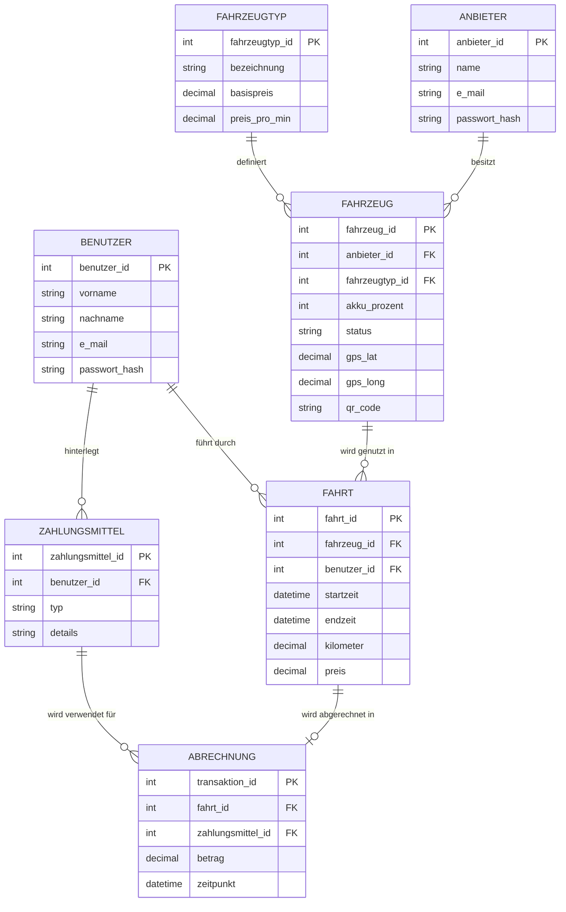
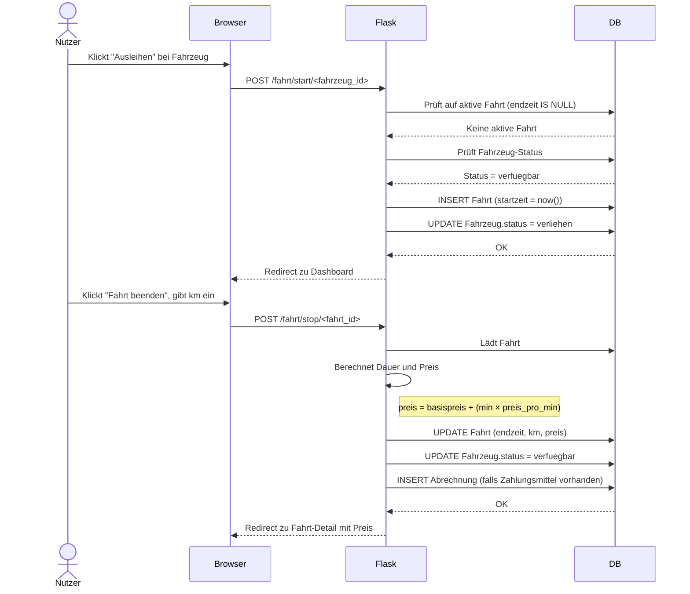
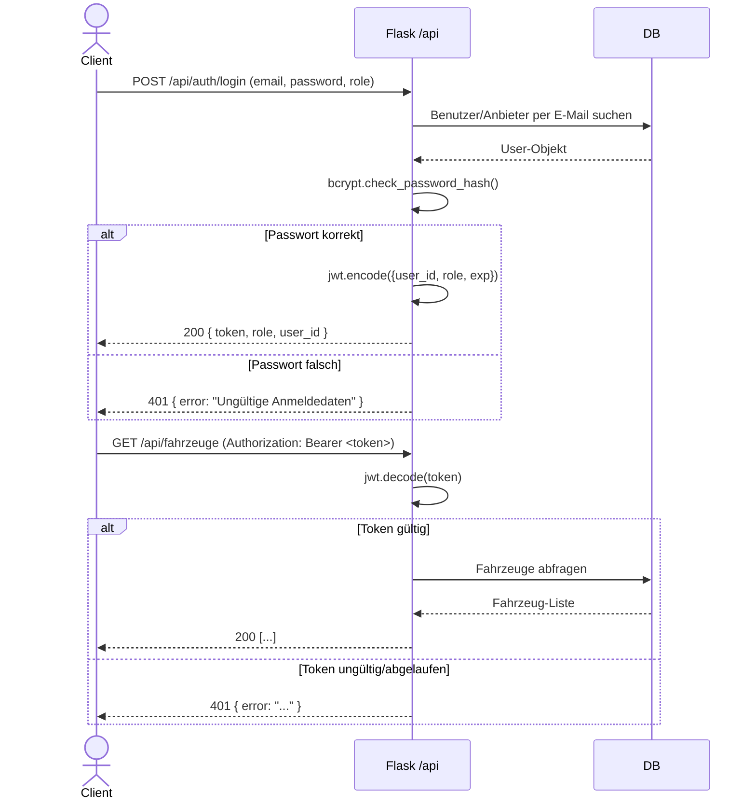
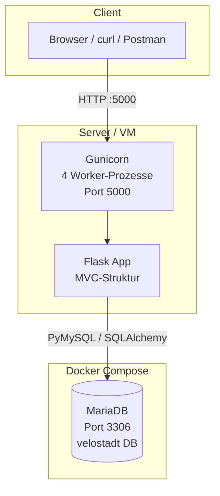

# Praxisarbeit DBWE.TA1A.PA – Velostadt

**Modul:** Datenbanken und Webentwicklung (DBWE)
**Studiengang:** HFINFA / HFINFP – 3. Studienjahr
**Datum:** 10. März 2026

---

## Management Summary

Velostadt ist eine webbasierte Plattform zum Verleih von E-Scootern und E-Bikes in einer Stadtverwaltung. Das System ermöglicht es Verleihanbieter:innen, ihre Fahrzeugflotte zu verwalten, und Endnutzer:innen, Fahrzeuge auszuleihen, zu fahren und automatisch abzurechnen.

**Technologie-Stack:**

| Komponente | Technologie |
|---|---|
| Programmiersprache | Python 3.9+ |
| Web-Framework | Flask 3.x |
| Datenbank | MariaDB 11 (via Docker) |
| Produktions-Webserver | Gunicorn |
| Authentifizierung (Web) | Flask-Login (Session-Cookie) |
| Authentifizierung (API) | JWT (PyJWT) |

**Erzielte Ergebnisse:**

- Vollständig lauffähige Webanwendung mit zwei Benutzerrollen (Anbieter, Nutzer)
- Fahrzeugverwaltung mit Statusverwaltung und GPS-Koordinaten
- Fahrtenbuch mit minutengenauer Abrechnung
- RESTful API mit JWT-Authentifizierung
- Interaktive API-Dokumentation via Swagger UI unter `/api/docs`

**Wichtigste Infrastruktur:** Die Anwendung läuft als Python/Gunicorn-Prozess; die Datenbank ist ein MariaDB-Container (Docker Compose). Der grösste Mehrwert liegt in der klaren Rollentrennung und der automatischen Preisberechnung. Das grösste Risiko ist der Single-Server-Betrieb ohne Load Balancing – für den Schulkontext aber ausreichend.

---

## 1. Anwendung

### 1.1 Anforderungen

#### Funktionale Anforderungen

| Nr | Anforderung | Status |
|---|---|---|
| FA-1 | Verleihanbieter können sich registrieren, anmelden und ihre Flotte verwalten | Umgesetzt |
| FA-2 | Nutzer:innen können sich registrieren, anmelden und Fahrzeuge ausleihen | Umgesetzt |
| FA-3 | Fahrzeuge haben eine eindeutige ID, Akku-Status und GPS-Koordinaten | Umgesetzt |
| FA-4 | Fahrzeuge haben einen QR-Code (UUID), über den sie eindeutig identifiziert werden | Umgesetzt |
| FA-5 | Nutzer:innen können ein Fahrzeug starten (Fahrt beginnen) und stoppen (Fahrt beenden) | Umgesetzt |
| FA-6 | Abrechnung: Basispreis + (Dauer in Minuten × Preis pro Minute) | Umgesetzt |
| FA-7 | Nutzer:innen können Zahlungsmittel hinterlegen; Abrechnung wird automatisch erstellt | Umgesetzt |
| FA-8 | RESTful API mit Lesezugriff auf Fahrzeuge und Fahrten | Umgesetzt |
| FA-9 | API-Authentifizierung via JWT Bearer Token | Umgesetzt |
| FA-10 | Neue Fahrzeugtypen (z.B. E-Bike) können ohne Code-Änderung per Datenbank ergänzt werden | Umgesetzt |

#### Nicht-funktionale Anforderungen

| Nr | Anforderung |
|---|---|
| NFA-1 | Passwörter werden gehasht gespeichert (bcrypt) – Klartext wird nie persistiert |
| NFA-2 | Erweiterbarkeit: Fahrzeugtypen sind in einer separaten Tabelle modelliert |
| NFA-3 | Source Code ist kommentiert und auf GitHub verfügbar |
| NFA-4 | Anwendung ist über öffentliche IP/URL für mindestens 4 Wochen erreichbar |

---

### 1.2 Bedienung (User Manual)

#### Startseite

Die Startseite (`/`) ist öffentlich zugänglich und bietet Links zur Anmeldung sowie zur Registrierung als Nutzer:in oder Anbieter:in.

#### Registrierung und Anmeldung

**Als Nutzer:in (Benutzer):**
1. Startseite aufrufen → „Als Nutzer:in registrieren"
2. Vorname, Nachname, E-Mail und Passwort eingeben, absenden
3. Mit denselben Daten unter „Anmelden" → Rolle „Nutzer:in" einloggen

**Als Anbieter:in:**
1. Startseite aufrufen → „Als Anbieter:in registrieren"
2. Firmenname, E-Mail und Passwort eingeben, absenden
3. Mit denselben Daten unter „Anmelden" → Rolle „Anbieter:in" einloggen

#### Dashboard – Anbieter:in

Nach dem Login landet die Anbieter:in direkt auf der Fahrzeugliste (`/meine-fahrzeuge`):

- **Fahrzeug hinzufügen** (`/fahrzeuge/neu`): Fahrzeugtyp wählen, Akku-Prozent, Status und GPS-Koordinaten eingeben. Ein QR-Code (UUID) wird automatisch generiert.
- **Fahrzeug bearbeiten** (`/fahrzeuge/<id>/bearbeiten`): Status, Akku, Standort aktualisieren.
- **Fahrzeug löschen** (`/fahrzeuge/<id>/loeschen`): Nur möglich, wenn das Fahrzeug nicht aktiv verliehen ist.

#### Dashboard – Nutzer:in (Benutzer)

Nach dem Login erscheint das Nutzer:innen-Dashboard (`/dashboard`):

- **Verfügbare Fahrzeuge** (`/fahrzeuge`): Liste aller Fahrzeuge mit Status „verfügbar". Pro Fahrzeug sind Typ, Akkustand, Standort und Preis sichtbar.
- **Fahrt starten**: Button „Ausleihen" bei einem Fahrzeug anklicken → Fahrt wird gestartet, Fahrzeug wechselt auf Status „verliehen".
- **Fahrt beenden**: Auf dem Dashboard die aktive Fahrt anzeigen lassen, gefahrene Kilometer eingeben, „Fahrt beenden" klicken. Der Preis wird berechnet und angezeigt.
- **Meine Fahrten** (`/meine-fahrten`): Übersicht aller vergangenen und aktiven Fahrten.
- **Zahlungsmittel** (`/zahlungsmittel`): Kreditkarte, Debitkarte, PayPal oder Rechnung hinterlegen.

---

### 1.3 API-Dokumentation

Die API ist unter dem Basispfad `/api` erreichbar. Eine interaktive Dokumentation (Swagger UI) steht unter `/api/docs` zur Verfügung.

#### Authentifizierung

Alle Endpunkte ausser `/api/auth/login` erfordern einen JWT Bearer Token im HTTP-Header:

```
Authorization: Bearer <token>
```

#### Endpunkte

---

**`POST /api/auth/login`** – JWT-Token anfordern

Request Body (JSON):

```json
{
  "email": "user@example.com",
  "password": "secret",
  "role": "benutzer"
}
```

`role` ist entweder `benutzer` oder `anbieter`. Standard: `benutzer`.

Response `200 OK`:

```json
{
  "token": "eyJ...",
  "role": "benutzer",
  "user_id": 3
}
```

Beispiel mit curl:

```bash
curl -X POST http://localhost:5000/api/auth/login \
  -H "Content-Type: application/json" \
  -d '{"email":"user@example.com","password":"secret","role":"benutzer"}'
```

---

**`GET /api/fahrzeuge`** – Alle Fahrzeuge auflisten

Optionaler Query-Parameter: `?status=verfuegbar|verliehen|in_wartung`

```bash
curl http://localhost:5000/api/fahrzeuge \
  -H "Authorization: Bearer <token>"
```

Response `200 OK` (Array):

```json
[
  {
    "fahrzeug_id": 1,
    "typ": "E-Scooter",
    "status": "verfuegbar",
    "akku_prozent": 87,
    "gps_lat": 47.376888,
    "gps_long": 8.541694,
    "qr_code": "550e8400-e29b-41d4-a716-446655440000",
    "basispreis": 1.00,
    "preis_pro_min": 0.25
  }
]
```

---

**`GET /api/fahrzeuge/<id>`** – Einzelnes Fahrzeug

```bash
curl http://localhost:5000/api/fahrzeuge/1 \
  -H "Authorization: Bearer <token>"
```

Response wie oben, einzelnes Objekt.

---

**`GET /api/fahrten`** – Fahrten auflisten

- **Benutzer** sehen nur eigene Fahrten.
- **Anbieter** sehen alle Fahrten auf ihren Fahrzeugen.

```bash
curl http://localhost:5000/api/fahrten \
  -H "Authorization: Bearer <token>"
```

Response `200 OK` (Array):

```json
[
  {
    "fahrt_id": 12,
    "fahrzeug_id": 1,
    "startzeit": "2026-03-10T08:15:00",
    "endzeit": "2026-03-10T08:42:00",
    "kilometer": 4.2,
    "preis": 7.75
  }
]
```

---

### 1.4 Architektur

#### 1.4.1 Datenmodell (ERD)



**Beschreibung:**

- `Anbieter` und `Benutzer` sind zwei separate Entitäten, beide mit Flask-Login integriert (prefixed IDs: `a-<id>` / `b-<id>`).
- `Fahrzeugtyp` ist ausgelagert, damit neue Typen (z.B. E-Bike) ohne Codeänderung ergänzt werden können.
- `Fahrzeug` hat einen `status` (`verfuegbar`, `verliehen`, `in_wartung`) sowie GPS-Koordinaten.
- `Fahrt` speichert Start- und Endzeit; der Preis wird beim Beenden berechnet.
- `Abrechnung` entsteht automatisch beim Fahrtende, falls ein Zahlungsmittel hinterlegt ist.

#### 1.4.2 Wichtige Abläufe

**Ablauf: Fahrt starten und beenden**



**Ablauf: API-Authentifizierung**



#### 1.4.3 Zusätzliche Technologien

**JWT (PyJWT) – API-Authentifizierung**

Im Unterricht wurde Flask-Login für die Session-basierte Web-Authentifizierung behandelt. Für die API wurde zusätzlich JWT (JSON Web Tokens) via `PyJWT` eingesetzt. Dies ist notwendig, weil API-Clients (curl, Postman) typischerweise keine Browser-Cookies verwalten. Ein JWT-Token ist selbst-validerend (enthält die User-ID und läuft nach 24 Stunden ab) und muss nicht serverseitig gespeichert werden.

*Quelle: [PyJWT Dokumentation](https://pyjwt.readthedocs.io/), RFC 7519*

**Docker Compose – Datenbankbereitstellung**

Der MariaDB-Datenbankserver wird via Docker Compose betrieben. Dies vereinfacht das Setup erheblich: Die Datenbank startet mit `docker compose up -d` und benötigt keine manuelle Installation. Die Konfiguration (Passwort, Datenbankname, User) ist in `docker-compose.yml` deklariert.

**Flask-Swagger-UI – API-Dokumentation**

Zur Darstellung einer interaktiven API-Dokumentation wurde `flask-swagger-ui` eingesetzt. Das OpenAPI-3.0-Spec-File (`app/static/swagger.yaml`) beschreibt alle Endpunkte, Schemas und Authentifizierungsanforderungen. Die UI ist unter `/api/docs` erreichbar und erlaubt es, die API direkt im Browser zu testen.

#### 1.4.4 Deployment-Diagramm



**Beschreibung:**

- **Gunicorn** startet 4 Worker-Prozesse und nimmt HTTP-Anfragen auf Port 5000 entgegen.
- **Flask** verarbeitet die Anfragen nach dem MVC-Muster: Controllers (Blueprints) → Models (SQLAlchemy) → Templates (Jinja2).
- **MariaDB** läuft in einem Docker-Container. Persistente Daten werden im Volume `./mariadb/data` gespeichert.
- Der Webserver (Gunicorn) und die Datenbank kommunizieren über den lokalen Netzwerkstack.

**Zugriffsinformationen:**

| Element | Wert |
|---|---|
| Web-URL | `http://<IP>:5000` |
| API-Basis | `http://<IP>:5000/api` |
| Swagger UI | `http://<IP>:5000/api/docs` |
| DB-Host | `localhost:3306` |
| DB-Name | `velostadt` |
| DB-User | `velouser` |

---

## 2. Testprotokoll

Die folgenden 10 Testfälle decken die wichtigsten funktionalen und nicht-funktionalen Anforderungen ab. Tests wurden manuell durchgeführt (Browser + curl).

| TC | Kurzbeschreibung | Vorgehen | Erwartetes Ergebnis | Tatsächliches Ergebnis | Status |
|---|---|---|---|---|---|
| TC-01 | Registrierung Benutzer | `/register/benutzer` mit Vorname, Nachname, E-Mail, Passwort ausfüllen und absenden | Weiterleitung zu `/login`, Erfolgsmeldung | Weiterleitung und Flash-Meldung "Registrierung erfolgreich" erscheinen | OK |
| TC-02 | Login Benutzer | `/login` mit E-Mail, Passwort, Rolle "Nutzer:in" | Weiterleitung zu `/dashboard` | Dashboard wird angezeigt | OK |
| TC-03 | Fahrzeug hinzufügen (Anbieter) | Als Anbieter einloggen, `/fahrzeuge/neu`, Typ und Akku angeben | Fahrzeug erscheint in der Liste mit auto-generiertem QR-Code | Fahrzeug in Liste sichtbar, QR-Code als UUID | OK |
| TC-04 | Fahrt starten | Als Benutzer einloggen, `/fahrzeuge`, "Ausleihen" klicken | Fahrzeug wechselt auf "verliehen", Dashboard zeigt aktive Fahrt | Status und Dashboard aktualisieren korrekt | OK |
| TC-05 | Doppelte Fahrt verhindern | Während aktiver Fahrt nochmals "Ausleihen" klicken | Flash-Warnung "Sie haben bereits eine aktive Fahrt" | Warnung erscheint, keine zweite Fahrt erstellt | OK |
| TC-06 | Fahrt beenden und Preisberechnung | Aktive Fahrt beenden, 5.0 km eingeben | Preis = Basispreis + (Dauer × Preis/min), Fahrzeug wieder "verfuegbar" | Preis korrekt berechnet und angezeigt, Status zurückgesetzt | OK |
| TC-07 | API Login (curl) | `curl -X POST /api/auth/login -d '{"email":"...","password":"...","role":"benutzer"}'` | JSON mit `token`, `role`, `user_id` | Token wird zurückgegeben | OK |
| TC-08 | API Fahrzeugliste (mit Token) | `curl /api/fahrzeuge -H "Authorization: Bearer <token>"` | JSON-Array aller Fahrzeuge | Liste wird korrekt zurückgegeben | OK |
| TC-09 | API ohne Token (Sicherheit) | `curl /api/fahrzeuge` ohne Authorization-Header | HTTP 401, `{"error": "Authorization-Header fehlt..."}` | 401 wird zurückgegeben | OK |
| TC-10 | Fahrzeug löschen während Verleih | Fahrzeug mit Status "verliehen" löschen wollen | Flash-Fehler "Fahrzeug kann nicht gelöscht werden – es ist aktuell verliehen" | Fehler erscheint, Fahrzeug bleibt in DB | OK |

---

## Anhang: Source Code

Der vollständige, kommentierte Source Code ist auf GitHub verfügbar:

**URL:** `https://github.com/<username>/velostadt2`

**Projektstruktur:**

```
velostadt2/
├── app/
│   ├── __init__.py          # App-Factory, Blueprint-Registrierung
│   ├── models.py            # SQLAlchemy-Modelle
│   ├── controllers/
│   │   ├── auth.py          # Registrierung, Login, Logout
│   │   ├── main.py          # Startseite, Dashboard
│   │   ├── fahrzeuge.py     # Fahrzeugverwaltung (Anbieter)
│   │   ├── fahrten.py       # Fahrten, Abrechnung (Benutzer)
│   │   └── api.py           # REST API mit JWT
│   ├── templates/           # Jinja2-HTML-Templates
│   └── static/
│       └── swagger.yaml     # OpenAPI 3.0 Spec
├── config.py                # Konfiguration (liest .env)
├── run.py                   # App-Einstiegspunkt
├── docker-compose.yml       # MariaDB-Container
└── requirements.txt         # Python-Abhängigkeiten
```
