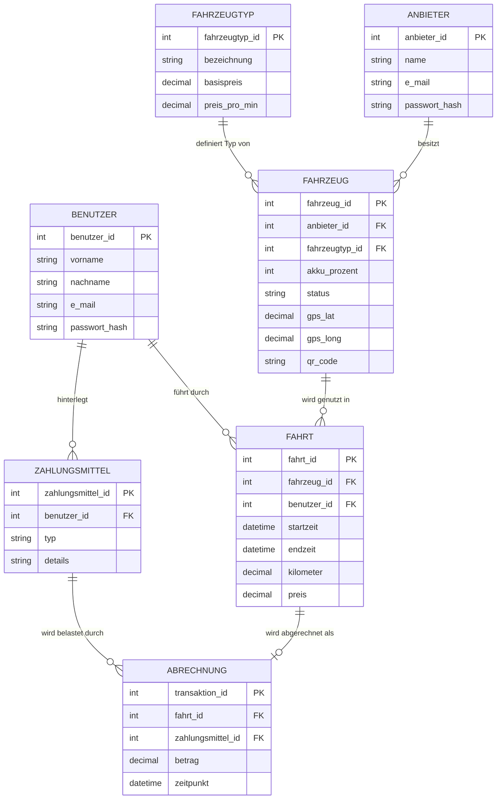
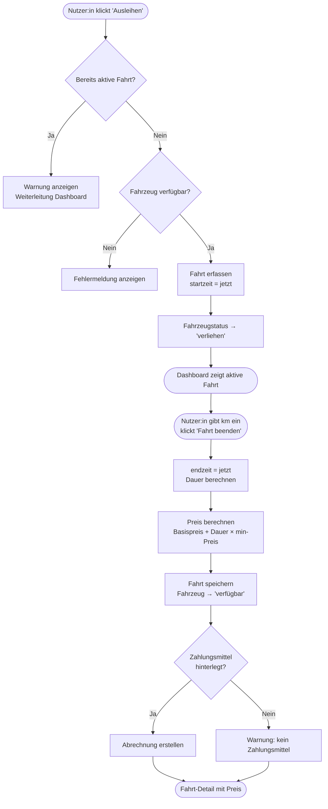
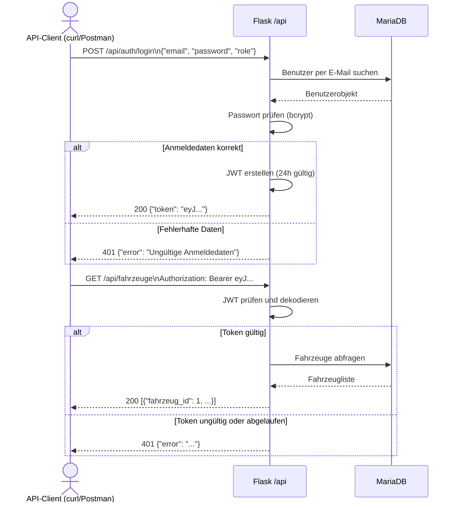
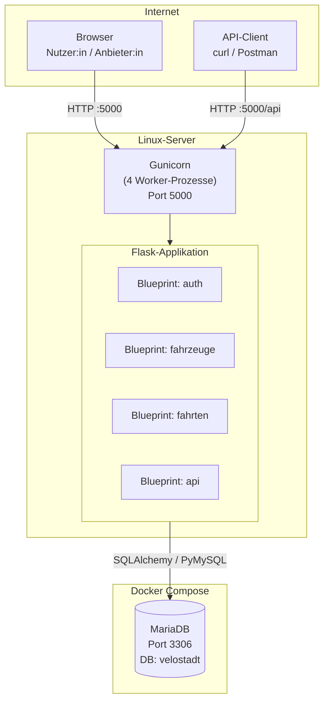

# Praxisarbeit DBWE.TA1A.PA
## Velostadt – Webplattform zum Verleih von E-Scootern und E-Bikes

**Modul:** Datenbanken und Webentwicklung (DBWE)
**Studiengang:** HFINFA / HFINFP – 3. Studienjahr
**Abgabedatum:** 10. März 2026

---

## Management Summary

Im Rahmen der Praxisarbeit des Moduls «Datenbanken und Webentwicklung» wurde die Webplattform **Velostadt** entwickelt. Das Ziel war die Umsetzung einer vollständigen, im Internet betriebenen Webanwendung für den Verleih von Elektrofahrzeugen (E-Scooter, E-Bikes) in einer Stadtverwaltung.

Die Plattform ermöglicht es Verleihanbieterinnen und -anbietern, ihre Fahrzeugflotte über einen geschützten Bereich zu verwalten. Nutzerinnen und Nutzer können sich registrieren, verfügbare Fahrzeuge ausleihen und werden nach der Fahrt automatisch nach einem minutengenauen Tarif abgerechnet. Zusätzlich stellt die Anwendung eine REST-API zur Verfügung, über die Fahrzeug- und Fahrtdaten programmatisch abgerufen werden können.

Als Technologieplattform wurde ein Linux-Server eingesetzt, auf dem der Python-Webserver Gunicorn die Flask-Anwendung betreibt. Die Datenbank (MariaDB) läuft als Docker-Container auf demselben Server. Der Source Code ist vollständig auf GitHub verfügbar.

**Wichtigster Mehrwert:** Die Anwendung setzt alle geforderten Anforderungen der Normaufgabe um und geht mit der REST-API mit JWT-Authentifizierung sowie der automatischen Fahrtabrechnung über das Minimum hinaus.

**Grösstes Risiko:** Die aktuelle Infrastruktur läuft auf einem einzelnen Server ohne Redundanz. Ein Serverausfall bedeutet vollständige Nichtverfügbarkeit der Plattform. Für den Schulkontext ist dies akzeptabel; für einen produktiven Betrieb wäre eine hochverfügbare Infrastruktur (Load Balancer, DB-Replikation) notwendig.

**Für das Management:** Die Anwendung ist unter folgender Adresse erreichbar und steht für mindestens vier Wochen nach Abgabe zur Verfügung:

| Zugang | Details |
|---|---|
| Web-URL | `http://<IP-Adresse>:5000` |
| API-Basis | `http://<IP-Adresse>:5000/api` |
| API-Dokumentation (Swagger) | `http://<IP-Adresse>:5000/api/docs` |
| Test-Login Nutzer | E-Mail: `nutzer@velostadt.ch` / Passwort: `Test1234` |
| Test-Login Anbieter | E-Mail: `anbieter@velostadt.ch` / Passwort: `Test1234` |
| GitHub Repository | `https://github.com/<username>/velostadt2` |

---

## 1. Anwendung

### 1.1 Anforderungen

Die Normaufgabe (Anhang A der Aufgabenstellung) definiert die Ausgangssituation: Eine Stadtverwaltung beauftragt die Entwicklung einer Online-Plattform zum Verleih von E-Scootern, bei der Privatpersonen und lokale Verleihfirmen Fahrzeuge anmelden und Nutzerinnen und Nutzer diese ausleihen, fahren und bezahlen können.

Daraus ergaben sich folgende wesentliche Anforderungen, die vollständig umgesetzt wurden:

**Registrierung und Authentifizierung**

Es gibt zwei klar getrennte Benutzerrollen: Verleihanbieter:innen (Anbieter) und Fahrgäste (Benutzer). Beide registrieren sich über separate Formulare mit E-Mail-Adresse und Passwort. Die E-Mail-Adresse muss eindeutig sein. Passwörter werden verschlüsselt (bcrypt) gespeichert und niemals im Klartext hinterlegt. Der Login unterscheidet nach Rolle.

**Fahrzeugverwaltung**

Anbieter:innen können Fahrzeuge erfassen, bearbeiten und löschen. Jedes Fahrzeug erhält einen eindeutigen QR-Code (UUID), wird einem Fahrzeugtyp zugeordnet (E-Scooter, E-Bike) und hat einen Akkustand, GPS-Koordinaten sowie einen Status (verfügbar, verliehen, in Wartung). Das Löschen eines aktiv verliehenen Fahrzeugs ist nicht möglich.

**Ausleihe und Rückgabe**

Nutzer:innen sehen alle verfügbaren Fahrzeuge und können ein Fahrzeug durch einen Klick ausleihen (in der Webanwendung ersetzt dies das QR-Code-Scannen). Start- und Endzeitpunkt sowie die gefahrenen Kilometer werden erfasst. Ein Nutzer kann immer nur eine aktive Fahrt gleichzeitig haben.

**Abrechnung**

Die Abrechnung erfolgt minutengenau nach der Formel:

> **Preis = Basispreis + (Dauer in Minuten × Preis pro Minute)**

Die Preise sind pro Fahrzeugtyp definiert. Wenn ein Zahlungsmittel hinterlegt ist, wird automatisch ein Abrechnungsdatensatz erstellt.

**REST-API**

Auf die Fahrzeug- und Fahrtdaten kann zusätzlich über eine REST-API zugegriffen werden. Die API-Authentifizierung erfolgt über JWT (JSON Web Token) und ist ohne Browser möglich.

---

### 1.2 Bedienung der Webanwendung (User Manual)

#### Startseite

Die Startseite (`/`) ist öffentlich zugänglich und stellt den Einstiegspunkt dar. Von hier aus gelangen Besucher:innen zur Anmeldung oder zur Registrierung.

#### Registrierung

Je nach Rolle gibt es zwei separate Registrierungsseiten:

- **Nutzer:in** (`/register/benutzer`): Vorname, Nachname, E-Mail-Adresse und Passwort (zweimal zur Bestätigung) werden eingegeben. Nach erfolgreicher Registrierung wird auf die Anmeldeseite weitergeleitet.
- **Anbieter:in** (`/register/anbieter`): Name des Unternehmens oder der Person, E-Mail-Adresse und Passwort. Das Vorgehen ist identisch.

In beiden Fällen wird die E-Mail-Adresse auf Einzigartigkeit geprüft. Bei bereits vorhandener Adresse erscheint eine Fehlermeldung.

#### Anmeldung und Abmeldung

Auf der Anmeldeseite (`/login`) werden E-Mail-Adresse, Passwort und Rolle (Nutzer:in oder Anbieter:in) eingegeben. Nach erfolgreicher Anmeldung wird man zum Dashboard weitergeleitet. Über den Menüpunkt «Abmelden» wird die Session beendet.

#### Bereich Anbieter:in

Nach dem Login landet die Anbieter:in direkt auf der eigenen Fahrzeugliste (`/meine-fahrzeuge`). Diese zeigt alle registrierten Fahrzeuge mit Status, Akkustand und QR-Code.

- **Neues Fahrzeug erfassen** (`/fahrzeuge/neu`): Fahrzeugtyp aus der Liste wählen, Akkustand in Prozent und Status setzen, optional GPS-Koordinaten erfassen. Der QR-Code wird automatisch als eindeutige UUID generiert.
- **Fahrzeug bearbeiten** (`/fahrzeuge/<id>/bearbeiten`): Alle Felder können nachträglich geändert werden. Dies ist typischerweise dann nötig, wenn ein Fahrzeug aufgeladen wurde (Akku-Prozent) oder in die Wartung geht (Statuswechsel).
- **Fahrzeug löschen** (`/fahrzeuge/<id>/loeschen`): Ein Fahrzeug kann nur gelöscht werden, wenn es nicht aktiv verliehen ist. Dies schützt laufende Fahrten vor Datenverlust.

#### Bereich Nutzer:in

Das Dashboard (`/dashboard`) zeigt der eingeloggten Nutzer:in ihre aktuell aktive Fahrt oder, falls keine aktiv ist, einen Hinweis auf die verfügbaren Fahrzeuge.

- **Verfügbare Fahrzeuge anzeigen** (`/fahrzeuge`): Alle Fahrzeuge mit Status «verfügbar» werden aufgelistet. Angezeigt werden Typ, Akkustand, Standort (GPS) sowie Basispreis und Preis pro Minute.
- **Fahrt starten**: Über die Schaltfläche «Ausleihen» bei einem Fahrzeug wird die Fahrt gestartet. Das Fahrzeug wechselt in den Status «verliehen» und ist für andere nicht mehr buchbar. Pro Nutzer:in ist immer nur eine gleichzeitige Fahrt möglich.
- **Fahrt beenden**: Auf dem Dashboard wird die aktive Fahrt angezeigt. Die Nutzer:in gibt die gefahrenen Kilometer ein und klickt auf «Fahrt beenden». Der Preis wird berechnet, das Fahrzeug wird wieder freigegeben und der Betrag wird angezeigt.
- **Fahrtübersicht** (`/meine-fahrten`): Alle vergangenen und die aktive Fahrt werden aufgelistet, mit Datum, Dauer, Kilometern und Preis.
- **Zahlungsmittel verwalten** (`/zahlungsmittel`): Nutzer:innen können ein Zahlungsmittel (Kreditkarte, Debitkarte, PayPal oder Rechnung) hinterlegen. Dieses wird bei Fahrtende automatisch für die Abrechnung verwendet. Fehlt ein Zahlungsmittel, erscheint nach der Fahrt eine Warnung.

---

### 1.3 API-Dokumentation

Die REST-API ermöglicht einen lesenden Zugriff auf Fahrzeug- und Fahrtdaten ohne Webbrowser. Alle API-Endpunkte befinden sich unter dem Pfad `/api`. Eine interaktive Dokumentation mit Testmöglichkeit steht unter `/api/docs` (Swagger UI) zur Verfügung.

#### Authentifizierung am API

Die Authentifizierung am API erfolgt über JWT (JSON Web Token). Zuerst muss ein Token angefordert werden, der anschliessend bei allen weiteren Anfragen als HTTP-Header mitgeschickt wird. Der Token ist 24 Stunden gültig.

**Schritt 1 – Token anfordern:**

```
POST http://<host>:5000/api/auth/login
```

Request-Body (JSON):
```json
{
  "email": "nutzer@velostadt.ch",
  "password": "Test1234",
  "role": "benutzer"
}
```

Die `role` ist entweder `benutzer` oder `anbieter`.

Antwort bei Erfolg (`200 OK`):
```json
{
  "token": "eyJhbGciOiJIUzI1NiIsInR5cCI6IkpXVCJ9...",
  "role": "benutzer",
  "user_id": 1
}
```

**Schritt 2 – Token bei allen weiteren Anfragen mitschicken:**

```
Authorization: Bearer <token>
```

#### Endpunkte

**Alle Fahrzeuge abrufen**

```
GET http://<host>:5000/api/fahrzeuge
```

Optionaler Filter nach Status:

```
GET http://<host>:5000/api/fahrzeuge?status=verfuegbar
```

Mögliche Statuswerte: `verfuegbar`, `verliehen`, `in_wartung`

Beispiel mit curl:
```bash
curl http://<host>:5000/api/fahrzeuge \
  -H "Authorization: Bearer <token>"
```

---

**Einzelnes Fahrzeug abrufen**

```
GET http://<host>:5000/api/fahrzeuge/<id>
```

Beispiel:
```bash
curl http://<host>:5000/api/fahrzeuge/1 \
  -H "Authorization: Bearer <token>"
```

---

**Fahrten abrufen**

```
GET http://<host>:5000/api/fahrten
```

Nutzer:innen sehen nur ihre eigenen Fahrten. Anbieter:innen sehen alle Fahrten auf ihren Fahrzeugen. Die Unterscheidung erfolgt automatisch anhand des Tokens.

```bash
curl http://<host>:5000/api/fahrten \
  -H "Authorization: Bearer <token>"
```

Antwort (Auszug):
```json
[
  {
    "fahrt_id": 5,
    "fahrzeug_id": 2,
    "startzeit": "2026-03-10T08:15:00",
    "endzeit": "2026-03-10T08:47:00",
    "kilometer": 4.2,
    "preis": 9.00
  }
]
```

---

**Fehlerantworten**

Alle Endpunkte ausser `/api/auth/login` antworten mit HTTP `401`, wenn kein oder ein ungültiger Token mitgeschickt wird:

```json
{ "error": "Authorization-Header fehlt oder ungültig" }
```

Bei einem abgelaufenen Token:
```json
{ "error": "Token abgelaufen" }
```

---

### 1.4 Architektur

#### 1.4.1 Datenmodell

Die Anwendung basiert auf einem relationalen Datenbankmodell mit sieben Tabellen. Das folgende Diagramm zeigt die Entitäten und ihre Beziehungen:



Die wichtigsten Designentscheide im Datenmodell:

`Anbieter` und `Benutzer` sind bewusst als zwei separate Tabellen modelliert, da sie unterschiedliche Attribute haben und unterschiedliche Rollen im System einnehmen. Eine gemeinsame Benutzertabelle mit Rollenfeld wäre eine Alternative, würde aber viele `NULL`-Werte erzeugen.

`Fahrzeugtyp` ist als eigene Tabelle ausgelagert. Dadurch können neue Fahrzeugtypen (z.B. E-Bike, Cargo-Bike) direkt in der Datenbank erfasst werden, ohne dass Änderungen am Quellcode notwendig sind. Dies entspricht der Anforderung nach Erweiterbarkeit.

`Abrechnung` wird als separater Datensatz nach jeder Fahrt erstellt. Dadurch bleibt die `Fahrt`-Tabelle sauber und die Abrechnungslogik (welches Zahlungsmittel, wann gebucht) ist klar getrennt.

#### 1.4.2 Wichtige Abläufe

**Ablauf: Fahrt starten und beenden**

Das folgende Aktivitätsdiagramm zeigt den vollständigen Ablauf einer Ausleihe aus Sicht der Nutzerin oder des Nutzers sowie des Systems:



Die Preisberechnung findet serverseitig statt und kann nicht durch den Client beeinflusst werden. Die Nutzerin oder der Nutzer gibt lediglich die gefahrenen Kilometer an; Startzeit und Endzeit werden vom Server gesetzt.

**Ablauf: API-Authentifizierung und Datenabruf**



#### 1.4.3 Zusätzliche Technologien

Im Vergleich zu den im Unterricht vorgestellten Technologien wurden folgende zusätzliche Mittel eingesetzt. Diese werden nachfolgend begründet und bewertet.

---

**JWT (JSON Web Token) – PyJWT**

Im Unterricht wurde die Authentifizierung über Flask-Login (Session-Cookies) behandelt. Für die REST-API wurde zusätzlich JWT eingesetzt, da API-Clients wie curl oder Postman keine Browser-Cookies verwalten können.

Ein JWT ist ein signiertes Token, das die Benutzer-ID und die Rolle als Nutzdaten (Claims) enthält und nach 24 Stunden abläuft. Das Token wird vom Server mit einem geheimen Schlüssel signiert und kann ohne Datenbankzugriff validiert werden.

*Vorteil:* Zustandslose Authentifizierung – der Server muss keine Session-Daten speichern.
*Nachteil:* Ein einmal ausgestelltes Token kann vor Ablauf nicht serverseitig widerrufen werden.

Quelle: RFC 7519 – JSON Web Token; PyJWT-Dokumentation (https://pyjwt.readthedocs.io/)

---

**Docker Compose – Datenbankbereitstellung**

Die MariaDB-Datenbank wird als Docker-Container betrieben und mit Docker Compose konfiguriert. Dies wurde gewählt, weil es die Einrichtung erheblich vereinfacht (keine manuelle Installation von MariaDB) und die Konfiguration (Datenbankname, Zugangsdaten) als Code deklariert ist. Zudem startet der Container nach einem Systemneustart automatisch wieder (`restart: unless-stopped`).

*Vorteil:* Reproduzierbare, portable Umgebung; einfaches Setup auf jedem Linux-Server.
*Nachteil:* Docker muss auf dem Server installiert sein; beim ersten Start muss die Datenbank initialisiert werden.

Quelle: Docker Compose Dokumentation (https://docs.docker.com/compose/)

---

**Flask-Swagger-UI – Interaktive API-Dokumentation**

Zur Dokumentation und zum Testen der API wurde Flask-Swagger-UI eingesetzt. Die API-Spezifikation wird in einem YAML-File (OpenAPI 3.0 Standard) beschrieben und im Browser unter `/api/docs` als interaktive Oberfläche dargestellt. Dies erleichtert dem Examinator das Testen der API erheblich, da kein externer Client notwendig ist.

*Vorteil:* Einheitliche, standardisierte API-Dokumentation; direkt im Browser testbar.
*Nachteil:* Zusätzliche Abhängigkeit; das YAML-File muss bei Änderungen manuell nachgeführt werden.

Quelle: OpenAPI 3.0 Spezifikation (https://swagger.io/specification/); flask-swagger-ui (https://pypi.org/project/flask-swagger-ui/)

---

#### 1.4.4 Bereitstellung der Komponenten

Die Applikation wird auf einem einzelnen Linux-Server betrieben. Das folgende Diagramm zeigt die Komponenten und ihre Kommunikationswege:



**Beschreibung:**

Gunicorn startet vier parallele Worker-Prozesse, die eingehende HTTP-Anfragen entgegennehmen und an die Flask-Applikation weiterleiten. Flask ist nach dem MVC-Muster mit Blueprints strukturiert: jeder Blueprint ist für einen Funktionsbereich zuständig (Authentifizierung, Fahrzeuge, Fahrten, API). SQLAlchemy übernimmt als ORM die Datenbankzugriffe; PyMySQL ist der Treiber für die Verbindung zu MariaDB.

Die MariaDB-Datenbank läuft als isolierter Docker-Container. Die Datenbankdateien werden in einem lokalen Volume (`./mariadb/data`) gespeichert und bleiben auch nach einem Container-Neustart erhalten.

**Reflexion: Wartbarkeit, Skalierbarkeit und Verfügbarkeit**

*Wartbarkeit:* Die MVC-Struktur mit klar getrennten Blueprints macht die Anwendung gut wartbar. Neue Funktionen können in eigene Blueprints ausgelagert werden, ohne bestehenden Code anzupassen. Das ORM (SQLAlchemy) abstrahiert SQL-Abfragen und reduziert fehleranfälligen Datenbank-Code.

*Skalierbarkeit:* Gunicorn mit mehreren Worker-Prozessen erlaubt es, mehrere Anfragen gleichzeitig zu verarbeiten. Die Anforderung von bis zu 500 gleichzeitigen Ausleihen ist bei entsprechender Server-Hardware erfüllbar. Eine horizontale Skalierung (mehrere Server hinter einem Load Balancer) wäre möglich, erfordert aber eine externe Session-Verwaltung (z.B. Redis) und eine netzwerkfähige Datenbank.

*Verfügbarkeit:* Der Docker-Container der Datenbank startet automatisch nach einem Systemneustart. Gunicorn muss als Systemdienst konfiguriert werden (z.B. via systemd), damit auch der Webserver nach einem Neustart automatisch startet. Für hochverfügbare Systeme wäre eine Datenbankreplikation (Primary/Replica) notwendig, die im Rahmen dieser Arbeit nicht umgesetzt wurde.

---

### 1.5 Testprotokoll

Die folgenden 10 Testfälle wurden manuell durchgeführt (Browser und curl). Sie decken die wesentlichen funktionalen Anforderungen ab. Ziel war es, die korrekte Funktion der Anwendung zu belegen und Grenzfälle zu überprüfen.

| TC | Kurzbeschreibung | Erwartetes Ergebnis | Tatsächliches Ergebnis | Bestanden |
|---|---|---|---|---|
| TC-01 | **Registrierung Benutzer** – Formular unter `/register/benutzer` mit gültigen Daten ausfüllen und absenden | Weiterleitung zu `/login`, Meldung «Registrierung erfolgreich» | Weiterleitung und Erfolgsmeldung erscheinen korrekt | Ja |
| TC-02 | **Registrierung mit bestehender E-Mail** – Registrierung mit einer bereits verwendeten E-Mail-Adresse | Fehlermeldung «Diese E-Mail ist bereits registriert» | Fehlermeldung wird angezeigt, keine doppelte Erfassung | Ja |
| TC-03 | **Login und Dashboard** – Anmeldung mit korrekten Daten als Benutzer | Weiterleitung zu `/dashboard` | Dashboard wird korrekt angezeigt | Ja |
| TC-04 | **Fahrzeug erfassen (Anbieter)** – Als Anbieter einloggen, Fahrzeug unter `/fahrzeuge/neu` erfassen | Fahrzeug erscheint in der Liste mit auto-generiertem QR-Code (UUID) | Fahrzeug sichtbar, QR-Code als UUID-String vorhanden | Ja |
| TC-05 | **Fahrt starten** – Als Benutzer verfügbares Fahrzeug ausleihen | Fahrzeugstatus wechselt auf «verliehen», Dashboard zeigt aktive Fahrt | Status und Dashboard aktualisieren korrekt | Ja |
| TC-06 | **Doppelausleihe verhindern** – Während aktiver Fahrt ein weiteres Fahrzeug ausleihen wollen | Warnmeldung «Sie haben bereits eine aktive Fahrt», keine zweite Fahrt wird erstellt | Warnung erscheint, Datenbankinhalt unverändert | Ja |
| TC-07 | **Fahrt beenden und Preisberechnung** – Aktive Fahrt mit 5.0 km beenden | Preis berechnet nach Formel (Basispreis + Minuten × Minutenpreis), Fahrzeug wieder «verfügbar» | Preis korrekt berechnet und angezeigt, Fahrzeugstatus zurückgesetzt | Ja |
| TC-08 | **API-Login (curl)** – `POST /api/auth/login` mit gültigen Zugangsdaten | HTTP 200, JSON mit `token`, `role`, `user_id` | Token wird zurückgegeben | Ja |
| TC-09 | **API-Anfrage ohne Token** – `GET /api/fahrzeuge` ohne Authorization-Header | HTTP 401, JSON mit Fehlermeldung | 401 und Fehlermeldung werden zurückgegeben | Ja |
| TC-10 | **Fahrzeug löschen bei aktiver Ausleihe** – Fahrzeug mit Status «verliehen» löschen wollen | Fehlermeldung «Fahrzeug kann nicht gelöscht werden – es ist aktuell verliehen» | Fehlermeldung erscheint, Fahrzeug bleibt in der Datenbank | Ja |

**Fazit Testprotokoll:** Alle 10 definierten Testfälle wurden erfolgreich bestanden. Die wichtigsten funktionalen Anforderungen – Registrierung, Ausleihe, Abrechnung und API-Zugriff – funktionieren korrekt. Grenzfälle (Doppelausleihe, Löschschutz) werden vom System behandelt.

---

## Anhang: Source Code

Der vollständige, kommentierte Quellcode ist auf GitHub verfügbar:

**Repository-URL:** `https://github.com/<username>/velostadt2`
**Zugang:** öffentlich lesbar, kein Passwort erforderlich

Die Projektstruktur folgt dem MVC-Muster:

```
velostadt2/
├── app/
│   ├── __init__.py          # App-Factory und Blueprint-Registrierung
│   ├── models.py            # Alle Datenbankmodelle (SQLAlchemy)
│   ├── controllers/
│   │   ├── auth.py          # Registrierung, Login, Logout
│   │   ├── main.py          # Startseite und Dashboard
│   │   ├── fahrzeuge.py     # Fahrzeugverwaltung (Anbieter)
│   │   ├── fahrten.py       # Ausleihe, Abrechnung, Zahlungsmittel
│   │   └── api.py           # REST-API mit JWT-Authentifizierung
│   ├── templates/           # HTML-Templates (Jinja2 / Bootstrap 5)
│   └── static/
│       └── swagger.yaml     # OpenAPI 3.0 API-Spezifikation
├── config.py                # Konfiguration (liest .env-Datei)
├── run.py                   # Einstiegspunkt der Anwendung
├── docker-compose.yml       # MariaDB-Konfiguration (Docker)
└── requirements.txt         # Python-Abhängigkeiten
```
